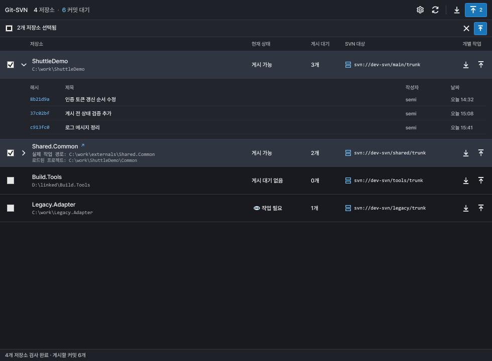

# Git-SVN Shuttle

Visual Studio에서 `git svn rebase`와 `git svn dcommit`을 실행하고, SVN에 게시할 로컬 커밋을 미리 확인하는 확장입니다.

## 주요 기능

- 솔루션 루트와 하위 폴더의 Git-SVN 저장소 자동 탐색
- 게시할 저장소 선택과 선택 순서 유지
- 저장소 행에서 실제 게시 순서의 대기 커밋 펼쳐보기
- 넓은 폭과 좁은 도구 창에 대응하는 반응형 저장소 테이블
- 준비·재검증·게시 진행과 저장소별 결과 표시
- 저장소별 `rebase`, `dcommit` 실행
- 여러 저장소 순차 실행
- 커밋되지 않은 변경과 실행할 수 없는 저장소 상태 표시
- `git svn rebase` 충돌 파일 표시와 계속·중단 복구
- 정션으로 연결된 외부 하위 프로젝트의 Git-SVN 저장소 탐색
- Windows 언어 설정과 무관한 한글 커밋 정보 표시

체크박스로 게시할 저장소를 고르고 저장소 행을 펼치면 다음 `dcommit` 대상 커밋이 실제 게시 순서로 표시됩니다. 커밋되지 않은 파일 변경이나 충돌이 있는 저장소는 게시 대상에서 제외되며 필요한 조치를 상태 영역에서 확인할 수 있습니다.

## 사용 방법

1. Git-SVN 작업 복사본이 포함된 솔루션을 엽니다.
2. **도구 > Git-SVN Shuttle**을 엽니다.
3. 아래쪽 화살표로 SVN 변경을 받습니다.
   충돌이 발생하면 파일을 해결하고 스테이징한 뒤 **계속**을 누르거나, 확인 후 rebase를 중단합니다.
4. 게시할 저장소를 선택하고 각 행을 펼쳐 게시 대상 커밋을 확인합니다.
5. 개별 위쪽 화살표 또는 선택 게시 버튼을 누르고 확인 창에서 실행 대상을 검토합니다.

상세 명령 출력은 **보기 > 출력 > Git-SVN Shuttle**에서 확인할 수 있습니다.

## dcommit 확인과 실행 보호

확인 창에는 SVN 대상과 게시할 커밋 목록이 표시됩니다. 실행 전 `dcommit --dry-run`을 수행하고, 확인 시점의 HEAD, 게시 대상, SVN 기준점과 Git-SVN 설정이 그대로인지 다시 검사합니다. 상태가 달라졌다면 게시하지 않고 새 확인을 요구합니다.

**모두 게시**는 모든 저장소를 먼저 검사한 뒤 순서대로 실행하며, 하나가 실패하면 그 지점에서 멈춥니다. 앞에서 성공한 다른 저장소의 `dcommit`은 자동으로 되돌리지 않습니다.

## 요구 사항

- x64 Windows의 Visual Studio 2022 또는 Visual Studio 2026
- .NET Framework 4.7.2 이상
- `git svn`을 실행할 수 있는 Git 환경
- 이미 clone/init이 완료된 Git-SVN 작업 복사본

도구 창에서 Git-SVN 실행 환경을 자동으로 확인합니다. 찾지 못하면 `git.exe`를 직접 선택하거나 Git for Windows와 MSYS2의 일반 설치 위치를 검색할 수 있습니다.

Git-SVN Shuttle은 Git-SVN을 설치하지 않으며, `git svn clone`, `init` 또는 SVN에서 Git으로의 마이그레이션을 수행하지 않습니다.

## 개인정보 보호

원격 분석을 사용하지 않으며 저장소 내용, 자격 증명 또는 개인 정보를 게시자에게 보내지 않습니다.

[소스 코드](https://github.com/semisemil/git-svn-shuttle) · [개인정보 처리 안내](https://github.com/semisemil/git-svn-shuttle/blob/main/PRIVACY.md) · [MIT 라이선스](https://github.com/semisemil/git-svn-shuttle/blob/main/LICENSE.txt)
